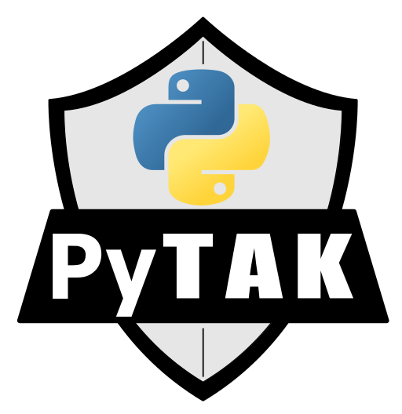

# DroneCOT - UAS Detection & Tracking for TAK

**DroneCOT** is a Python gateway that converts drone Remote ID, Open Drone ID (ODID), and DJI Drone ID signals into [Cursor on Target (CoT)](https://www.mitre.org/focus-areas/defense-and-intelligence/cursor-on-target) events for the [Team Awareness Kit (TAK)](https://tak.gov) ecosystem — enabling **real-time C-UAS situational awareness** in ATAK, WinTAK, iTAK, and TAK Server.

Use DroneCOT to detect, track, and display unmanned aircraft system (UAS) activity on your TAK common operating picture (COP) — from compliant Remote ID broadcasts to proprietary DJI Drone ID signals captured by AntSDR receivers.

Built on [PyTAK](https://pytak.rtfd.io).

---

## C-UAS Capabilities

DroneCOT supports multiple drone detection sensor feeds, making it suitable for a range of **counter-UAS (C-UAS)** and **UAS situational awareness** missions:

| Feed | Protocol | Source |
|------|----------|--------|
| `serial://` | MAVLink Open Drone ID | Cube Orange, mRo X2.1, serial ODID receivers |
| `mqtt://` | Open Drone ID over MQTT | Network-connected RID sensors |
| `wifi://` | Wi-Fi Beacon + NAN (802.11) | Linux monitor-mode wireless adapter |
| `ble://` | Bluetooth Low Energy (BLE) | Sniffle-compatible BLE sniffer dongle |
| `wireless://` | Wi-Fi + BLE combined | Both Wi-Fi and BLE simultaneously |
| `udp://` | Pre-decoded Wi-Fi / BLE JSON (UDP 9999) | Drone detection nodes broadcasting JSONL |
| `tcp://…:41030` | DJI AntSDR binary frames | AntSDR E200 (DJI Drone ID, port 41030) |
| `tcp://…:52002` | DJI AntSDR text CSV | AntSDR E200 text output (port 52002) |
| TCP listener | Scanner-push mode | Remote scanner connects to DroneCOT |

Each feed produces CoT contact events (UAS position, operator location, home point) that appear as live tracks on your TAK map.

---

## Features

- **Multi-protocol C-UAS sensor fusion** — ingest Remote ID and DJI Drone ID from heterogeneous sensors simultaneously using side-by-side systemd instances
- **Open Drone ID (ODID) / Remote ID (RID)** — decode FAA/EASA-compliant Remote ID broadcasts over MAVLink serial, MQTT, Wi-Fi 802.11, and BLE
- **DJI Drone ID (AntSDR)** — decode proprietary DJI binary frame and text CSV output from AntSDR E200 receivers; supports both binary (port 41030) and text (port 52002) feeds
- **DJI TCP listener** — accept scanner-push connections for deployment with centralized drone detection sensors
- **TAK integration** — outputs CoT XML to ATAK, WinTAK, iTAK, TAK Server, and TAK multicast; supports TLS-authenticated TAK Server connections via PyTAK
- **Breadcrumb tracks** — optional UAS trail history on the TAK map
- **Systemd-native** — user-level systemd template for running multiple feeds side-by-side without root

---

## Installation

```sh
pip install dronecot
```

For Wi-Fi and BLE wireless capture:

```sh
pip install 'dronecot[wireless]'
```

### From source

```sh
git clone https://github.com/snstac/dronecot.git
cd dronecot
pip install .
```

---

## Quick Start

Create a `config.ini`:

```ini
[dronecot]
COT_URL = udp+wo://239.2.3.1:6969

# Choose one FEED_URL for your sensor:

# MAVLink serial Remote ID (Cube Orange, mRo X2.1)
FEED_URL = serial:///dev/ttyACM0:115200

# MQTT Open Drone ID
# FEED_URL = mqtt://broker.example.net:1883

# Wi-Fi monitor mode Remote ID
# FEED_URL = wifi://wlan0

# BLE Remote ID (Sniffle dongle)
# FEED_URL = ble://

# Both Wi-Fi and BLE
# FEED_URL = wireless://wlan0

# Pre-decoded Remote ID JSON over UDP (port 9999)
# FEED_URL = udp://0.0.0.0:9999

# DJI AntSDR binary (port 41030)
# FEED_URL = tcp://192.168.1.10:41030

# DJI AntSDR text CSV (port 52002)
# FEED_URL = tcp://192.168.1.10:52002
```

Run:

```sh
dronecot -c config.ini
```

---

## DJI Drone ID / AntSDR Configuration

DroneCOT decodes DJI's proprietary Drone ID protocol as captured by [AntSDR E200](https://www.microphase.cn/en/uas) receivers running DJI firmware.

```ini
[dronecot]
COT_URL = tcp://tak-server.example.net:8089

# Binary frame feed (default DJI AntSDR port)
FEED_URL = tcp://192.168.1.10:41030

# Or text CSV feed
# FEED_URL = tcp://192.168.1.10:52002

# TCP listener (scanner connects to us)
# DJI_TCP_PORT = 52002

# Optional: sensor position for relative geometry
DJI_SENSOR_LAT = 37.7749
DJI_SENSOR_LON = -122.4194
DJI_SENSOR_HAE = 10.0
DJI_SENSOR_NAME = AntSDR-Alpha
```

---

## Running as a Service

See [docs/usage.md](docs/usage.md) for full systemd setup. Quick reference:

```ini
# /etc/systemd/system/dronecot.service
[Unit]
Description=DroneCOT - UAS Detection for TAK
Documentation=https://dronecot.rtfd.io
After=network.target

[Service]
ExecStart=/usr/local/bin/dronecot -c /etc/dronecot.ini
EnvironmentFile=-/etc/default/dronecot
Restart=always
RestartSec=30

[Install]
WantedBy=multi-user.target
```

### Multiple sensors side-by-side

Use the bundled user systemd template to run a serial MAVLink feed and an AntSDR DJI feed simultaneously:

```sh
make install_user_systemd
```

```sh
# ~/.config/dronecot/serial.env
FEED_URL=serial:///dev/ttyACM0:115200
COT_URL=udp+wo://239.2.3.1:6969

# ~/.config/dronecot/antsdr.env
FEED_URL=tcp://192.168.1.10:41030
COT_URL=udp+wo://239.2.3.1:6969
DJI_SENSOR_NAME=AntSDR-Alpha

systemctl --user enable --now dronecot@serial dronecot@antsdr
```

---

## Documentation

Full documentation at **[dronecot.rtfd.io](https://dronecot.rtfd.io)** — includes configuration reference, feed-specific setup, TAK Server TLS, and troubleshooting.

---

## About

DroneCOT is developed by [Sensors & Signals LLC](https://www.snstac.com) — builders of open-source TAK gateway tools for public safety, defense, and critical infrastructure protection.

Related projects:
- [PyTAK](https://github.com/snstac/pytak) — Python TAK framework
- [ADSBCOT](https://github.com/snstac/adsbcot) — ADS-B aircraft tracking for TAK
- [APRS2TAK](https://github.com/snstac/aprscot) — APRS position reporting for TAK

Contact: [info@snstac.com](mailto:info@snstac.com) · [snstac.com](https://www.snstac.com)

---

## License

### DroneCOT

Copyright Sensors & Signals LLC https://www.snstac.com/

Licensed under the Apache License, Version 2.0 (the "License");
you may not use this file except in compliance with the License.
You may obtain a copy of the License at http://www.apache.org/licenses/LICENSE-2.0

Unless required by applicable law or agreed to in writing, software
distributed under the License is distributed on an "AS IS" BASIS,
WITHOUT WARRANTIES OR CONDITIONS OF ANY KIND, either express or implied.
See the License for the specific language governing permissions and
limitations under the License.

### open_drone_id.py

Copyright (c) 2022 BlueMark Innovations BV

Permission is hereby granted, free of charge, to any person obtaining a copy of this software and associated documentation files (the "Software"), to deal in the Software without restriction, including without limitation the rights to use, copy, modify, merge, publish, distribute, sublicense, and/or sell copies of the Software, and to permit persons to whom the Software is furnished to do so, subject to the following conditions:

The above copyright notice and this permission notice shall be included in all copies or substantial portions of the Software.

THE SOFTWARE IS PROVIDED "AS IS", WITHOUT WARRANTY OF ANY KIND, EXPRESS OR IMPLIED, INCLUDING BUT NOT LIMITED TO THE WARRANTIES OF MERCHANTABILITY, FITNESS FOR A PARTICULAR PURPOSE AND NONINFRINGEMENT. IN NO EVENT SHALL THE AUTHORS OR COPYRIGHT HOLDERS BE LIABLE FOR ANY CLAIM, DAMAGES OR OTHER LIABILITY, WHETHER IN AN ACTION OF CONTRACT, TORT OR OTHERWISE, ARISING FROM, OUT OF OR IN CONNECTION WITH THE SOFTWARE OR THE USE OR OTHER DEALINGS IN THE SOFTWARE.
