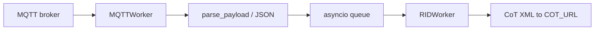

# Feeds

DroneCOT ingests Remote ID data from one input feed at a time, selected by `FEED_URL`. Parsed data is converted to CoT and sent to `COT_URL`.

## MQTT feed

When `FEED_URL` contains `mqtt`, **MQTTWorker** subscribes to `MQTT_TOPIC` and processes JSON payloads.

### Message types

1. **Remote ID (UAS data)** — JSON with a `data` object containing `UASdata` (base64 Open Drone ID pack) and sensor metadata (`sensor ID`, `RSSI`, `MAC address`, `type`, `timestamp`, etc.).

2. **Sensor status** — JSON with `status` (and typically without a position topic). Used for sensor location CoT when GPS is not in the aircraft message.

Payloads may be plain JSON or **LZMA-compressed** JSON (detected automatically).

### Example structure

See test fixtures in the repository:

- [`tests/data/WiFi-beacon.json`](https://github.com/snstac/dronecot/blob/main/tests/data/WiFi-beacon.json)
- [`tests/data/WiFi-NaN.json`](https://github.com/snstac/dronecot/blob/main/tests/data/WiFi-NaN.json)
- [`tests/data/sensor_status.json`](https://github.com/snstac/dronecot/blob/main/tests/data/sensor_status.json)
- [`tests/data/ua_payload.json`](https://github.com/snstac/dronecot/blob/main/tests/data/ua_payload.json)

### Processing flow



---

## Serial feed (MAVLink)

When `FEED_URL` contains `serial`, **SerialWorker** opens a MAVLink connection and listens for `OPEN_DRONE_ID_MESSAGE_PACK` messages.

### Configuration

```ini
FEED_URL = serial:///dev/ttyACM0:115200
```

Optional overrides: `SERIAL_PORT`, `SERIAL_BAUD_RATE`.

### Processing flow

1. Connect and wait for MAVLink heartbeat (20 s timeout).
2. On `OPEN_DRONE_ID_MESSAGE_PACK`, decode via `odid.message_pack_to_dict`.
3. Enqueue flattened fields for **RIDWorker** (same CoT path as MQTT).

Other MAVLink message types are ignored (except heartbeat logging at debug level).

---

## CoT output

**RIDWorker** converts parsed data to:

- Operator CoT (`rid_op_to_cot_xml`)
- UAS CoT (`rid_uas_to_cot_xml`)
- Sensor status CoT (`sensor_status_to_cot`) when applicable

UIDs use MAC address when present (Drone Hone–compatible format). See [Configuration](configuration.md) for CoT type overrides.

---

## Screenshots


Remote ID tracks in ATAK with sensor metadata in remarks and `__cuas` / `__dh-uas` detail elements.
