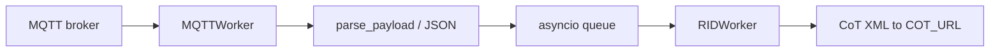
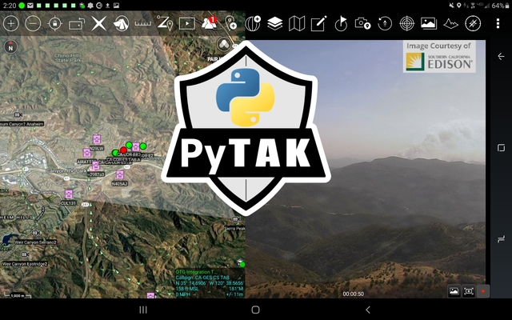

# Feeds

DroneCOT ingests Remote ID data from an input feed selected by `FEED_URL`. Parsed data is converted to CoT and sent to `COT_URL`. Use `wireless://` to run Wi-Fi and BLE capture together.

## MQTT feed

When `FEED_URL` contains `mqtt`, **MQTTWorker** subscribes to `MQTT_TOPIC` and processes JSON payloads.

### Message types

1. **Remote ID (UAS data)** — JSON with a `data` object containing `UASdata` (base64 Open Drone ID pack) and sensor metadata (`sensor ID`, `RSSI`, `MAC address`, `type`, `timestamp`, etc.).

2. **Sensor status** — JSON with `status` (and typically without a position topic). Used for sensor location CoT when GPS is not in the aircraft message.

Payloads may be plain JSON or **LZMA-compressed** JSON (detected automatically).

### Example structure

See test fixtures in the repository:

- [`tests/data/WiFi-beacon.json`](https://github.com/snstac/dronecot/blob/main/tests/data/WiFi-beacon.json)
- [`tests/data/WiFi-NaN.json`](https://github.com/snstac/dronecot/blob/main/tests/data/WiFi-NaN.json)
- [`tests/data/sensor_status.json`](https://github.com/snstac/dronecot/blob/main/tests/data/sensor_status.json)
- [`tests/data/ua_payload.json`](https://github.com/snstac/dronecot/blob/main/tests/data/ua_payload.json)

### Processing flow



---

## Serial feed (MAVLink)

When `FEED_URL` contains `serial`, **SerialWorker** opens a MAVLink connection and listens for `OPEN_DRONE_ID_MESSAGE_PACK` messages.

### Configuration

```ini
FEED_URL = serial:///dev/ttyACM0:115200
```

Optional overrides: `SERIAL_PORT`, `SERIAL_BAUD_RATE`.

### Processing flow

1. Connect and wait for MAVLink heartbeat (20 s timeout).
2. On `OPEN_DRONE_ID_MESSAGE_PACK`, decode via `odid.message_pack_to_dict`.
3. Enqueue flattened fields for **RIDWorker** (same CoT path as MQTT).

Other MAVLink message types are ignored (except heartbeat logging at debug level).

---

## Wi-Fi feed (Linux monitor mode)

When `FEED_URL` contains `wifi` or `wireless`, **WifiWorker** captures 802.11 management frames in monitor mode and decodes Open Drone ID from:

- **Wi-Fi Beacon** (subtype 0x8) — ASTM vendor IE (OUI `FA:0B:BC`, type `0x0D`)
- **Wi-Fi NAN** action frames (subtype 0x0D) — Wi-Fi Alliance NAN service discovery

### Configuration

```ini
FEED_URL = wifi://wlan0
WIFI_CHANNEL = 6
; Optional 2.4 / 5 GHz hopping:
; WIFI_HOP_CHANNELS = 6,149
; WIFI_HOP_DWELL = 3,1
```

Offline replay:

```ini
FEED_URL = wifi+pcap:///path/to/capture.pcapng
```

### Requirements

- Linux with `iw` and `ip`
- USB Wi-Fi adapter with **monitor mode** support
- `pip install 'dronecot[wifi]'` (Scapy)
- `CAP_NET_RAW` and `CAP_NET_ADMIN` (run as root or `setcap` on Python)

Reference: [opendroneid-core-c](https://github.com/opendroneid/opendroneid-core-c), [wireshark-dissector](https://github.com/opendroneid/wireshark-dissector).

---

## BLE feed (Sniffle dongle)

When `FEED_URL` contains `ble` or `wireless`, **BleWorker** receives BLE advertisements from a [Sniffle](https://github.com/nccgroup/Sniffle)-flashed dongle (nRF52840 or Sonoff CC2652P).

### Configuration

```ini
FEED_URL = ble:///dev/ttyUSB0
; Or auto-detect:
; FEED_URL = ble://auto
BLE_BAUD_RATE = 2000000
BLE_LONG_RANGE = 1
BLE_EXTENDED = 1
```

Combined Wi-Fi + BLE:

```ini
FEED_URL = wireless://wlan0
BLE_SERIAL = /dev/ttyUSB0
WIFI_CHANNEL = 6
```

### Sniffle setup

1. Flash [Sniffle](https://github.com/nccgroup/Sniffle) firmware onto a compatible dongle.
2. Install the Sniffle Python CLI on `PYTHONPATH`:

   ```sh
   git clone https://github.com/nccgroup/Sniffle.git
   export PYTHONPATH="$PYTHONPATH:/path/to/Sniffle/python_cli"
   ```

Sniffle is GPLv3 — install separately; DroneCOT invokes it at runtime when BLE capture is enabled.

Reference: [receiver-android](https://github.com/opendroneid/receiver-android) (BLE AD layout).

---

## CoT output

**RIDWorker** converts parsed data to:

- Operator CoT (`rid_op_to_cot_xml`)
- UAS CoT (`rid_uas_to_cot_xml`)
- Sensor status CoT (`sensor_status_to_cot`) when applicable

UIDs use MAC address when present (Drone Hone–compatible format). See [Configuration](configuration.md) for CoT type overrides.

---

## Screenshots



Remote ID tracks in ATAK with sensor metadata in remarks and `__cuas` / `__dh-uas` detail elements.
